<div style="text-align:center">RITSEC CTF 2021 - Forensics </div>

<!--more-->

## 1597  

  
<br>
Clone the git repo that's given and look at the revision history. One of the previous files contains the flag.  
<br>


## Inception CTF Dream 1 

  
<br>
Open the zip file that you're given. Open the text document and the first flag is just written backwards.  
<br>  
  

## Inception CTF Dream 2

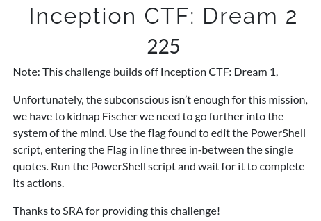  
<br>
Open the next zip file using the password **Dreamland** from the previous step.  
Inside is a text document with a string of numbers which can be converted to ASCII characters to reveal the next flag.  
<br>
  
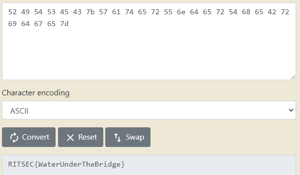  

## Inception CTF Dream 3  

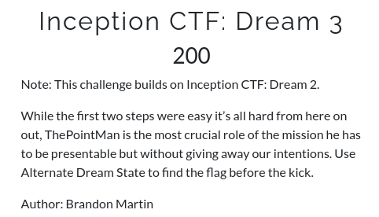  
<br>
Open the next zip file using **WaterUnderTheBridge** and inside is another text file. This string is base64 endcoded. Once you decode it it give you a string of hex values that can be converted to ASCII characters and give you the flag.  
<br>
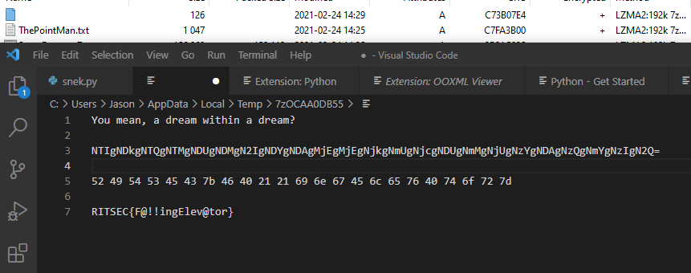

## Inception CTF Dream 4

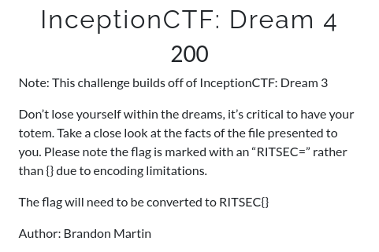  
<br>
Open the next zip with **F@!!ingElev@tor**. Inside is an .hta file that when you inspect near the bottom you'll find morse cord in white font that you'll have to highlight to see. Decode that to get the flag.  
<br>
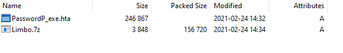

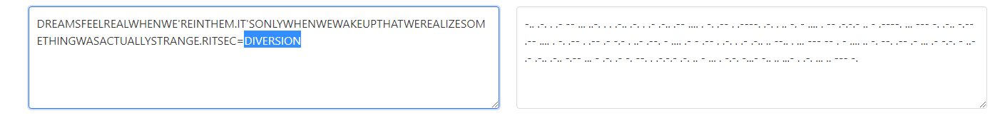

## PleaseClickAllTheThings 1

  
<br>
You're given an Outlook .msg file with three different attachments. The first is an html with embedded javascript. Open the file with a code viewer and you can see a URL encoded string that will decode into html text. Near the bottom is a base64 string that can be decoded to get the flag.  
<br>

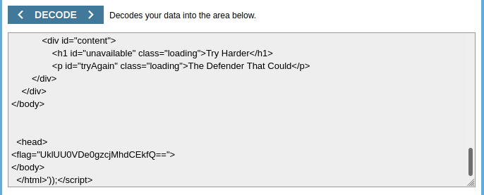


## PleaseClickAllTheThings 2

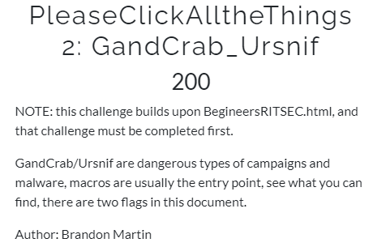
<br>
Take the given file and run oledump against it to view the macros. The flag is in A4.
```
python3 oledump.py -s A4 ../GandCrab_Ursnif_RITSEC.docm
```

<br>

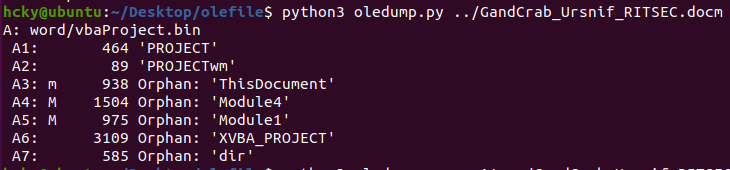  
  

## Parcel

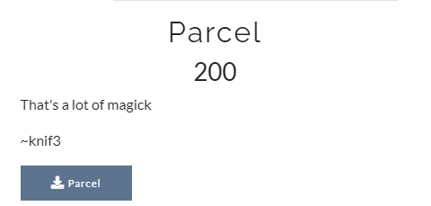
<br>
The file you download doesn't have an extension but if you run a file command you can see it's a gunzip archive. Add .gz to the end and unzip the file and you'll find a text file of emails going back and forth between people. All files are base64 encoded with the longer files able to be converted into PNG images. Convert all the image files and rearrange them to see the flag. RS{Im_doing_a_v1rtual_puzzl3}  
<br>


## Blob

  
<br>
Clone the git repo and view the revision list. Cat the git blob and get the flag.  
<br>


