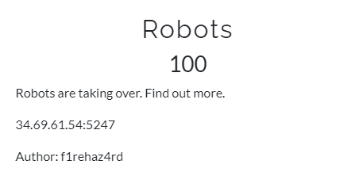
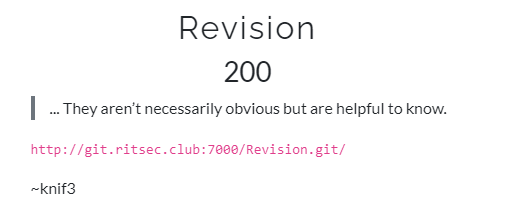
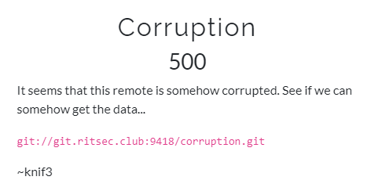
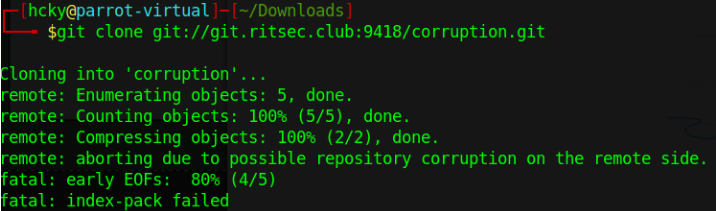
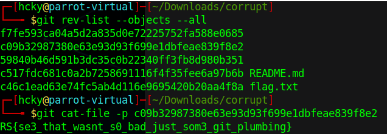
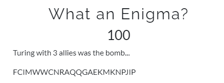
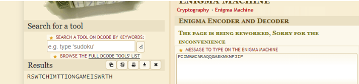
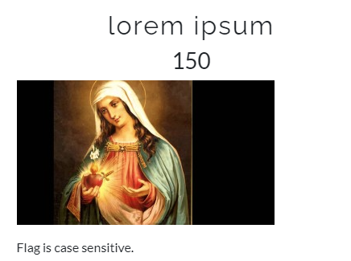

<div style="text-align:center">RITSEC CTF 2021 - Misc/Web/Crypto </div>

<!--more-->

## Robots

  
<br>
Go to the website given and check the /robots.txt file. The flag is given in base64 encoding.  
<br>


## Revision

  
<br>
More or less like the other git challenges.  I tried to script out some of it but for whatever reason every time I tried to greab the SHA's of the blobs it didnt' pull all of them. Either way, you can see what I was trying to do first and then when that didn't work I just pulled the repo to Github desktop and looked at the revisions manually.  

Try 1  
<br>
  

```
 #!/bin/bash

while read x; do 
git cat-file -p "$x" >> output.txt
done < ~/Downloads/Revision/sha.txt
```

With this I kept getting incomplete flags such as RS{Iyur1pedh3git_c0ms}.  I'll have to go back and see if I can figure out what was going on.  
<br>
Try2  
<br>


## Corruption

  
<br>
When you try to clone this repo it throws an error that it may be corrupted. After some googling it turns out this is a common error and can possibly be fixed by setting a few git global config options to certain settings. Afterwards I was able to view the revisions to the repo and one of them was the flag.  
<br>





## Enigma
  
<br>
The text you're given is crypted with the Enigma Machine. Turing was one of the scientists to crack it during WW2. Go watch The Imitation Game.  
<br>


## Lorem Ipsum

  
<br>
This text is encoded using the Ave Maria cipher. The flag is case sensitive so you have to pay attention to which words are capitalized in the cipher since everything comes out all capitals if you put it into an online decoder. A lot of people though the flag was wrong on this one because they weren't paying attention.  
<br>


