## OSINT
### Find Me
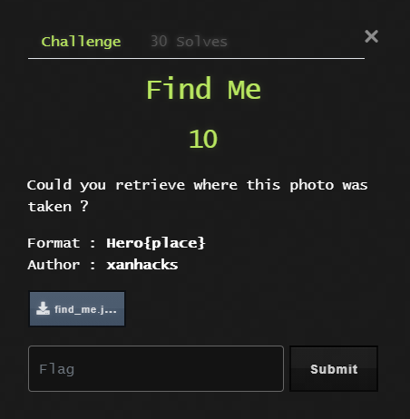  
 
Reverse image search the given file. One of the websites states that it is the Portes Mordelaises.  
 
  
 
### Social ID #1
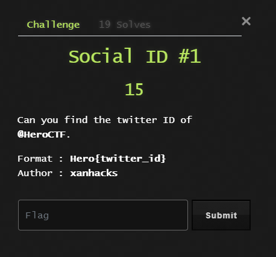  
 
Head over to https://tweeterid.com and just put in the HeroCTF handle.  
 
  
### Social ID #2
  
 
Head over to https://tweeterid.com again and just put in the ID instead.  
   
  
### Transfer
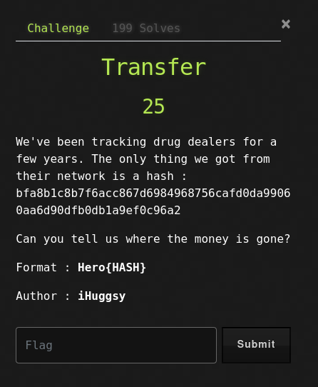  
 
Look up the bitcoin transaction ID and find the wallet the transaction went to.  
 

### ProtonDate
  
 
Look up the email from within Proton Mail and it will show you when the RSA key was created.  
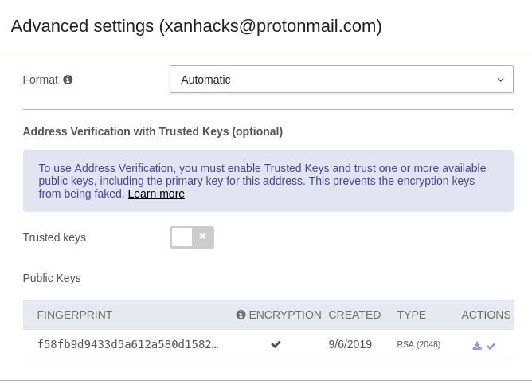  
### Pushhhh
  
 
View the HeroCTF_v2 repository and grab the flag.  
 

## Forensics
### We Need You 1
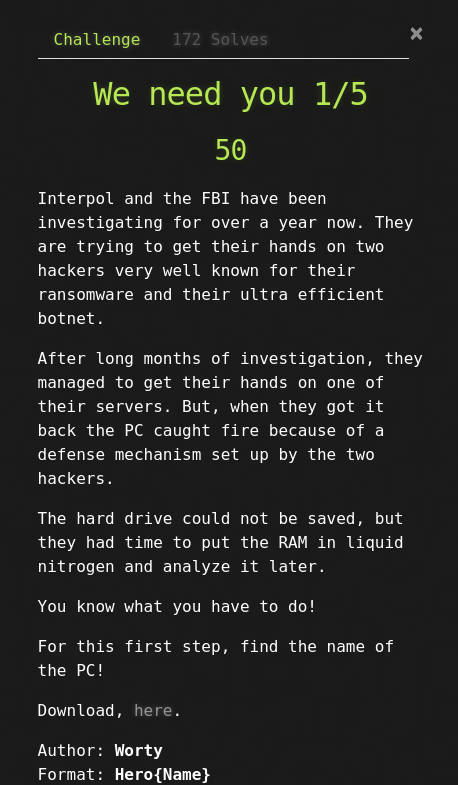  
 
Use the volatility framework to parse through the downloadable memory dump. Use imageinfo to grab the system profile, then hivelist to view the place of the SYSTEM key, then printkey to grab the contents.  
 
  
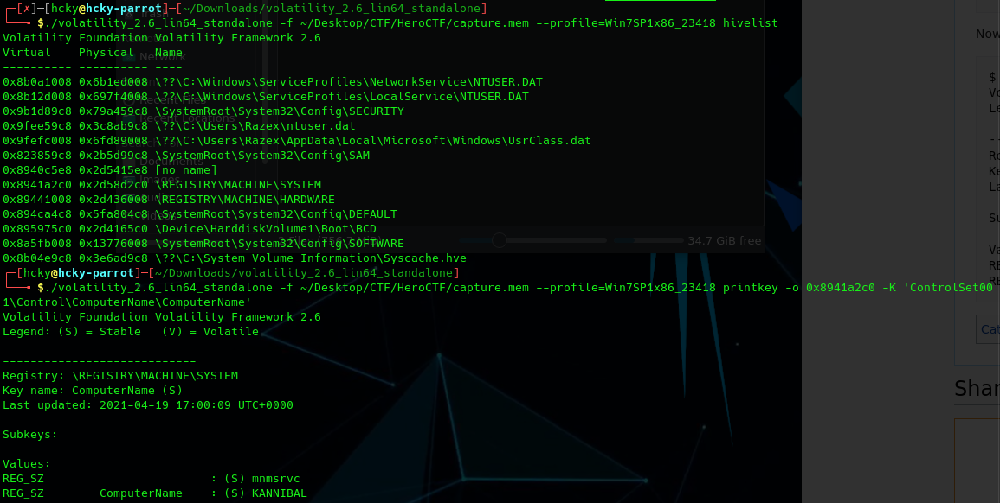  
### We Need You 2
  
 
Grab the NTLM hash from the \Config\DEFAULT key and throw it to an NTLM hash site for the flag.  
 
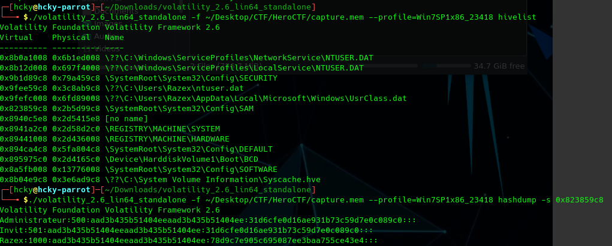  
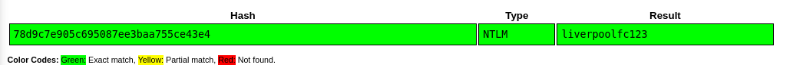  
### We Need You 3
  
 
Use the netscan option to view any connections made to the machine.  
 
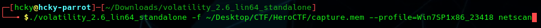
  
## Other
### Russian
  
 
Open all the zip files to get the flag.  
 
  
### Holy Abbot
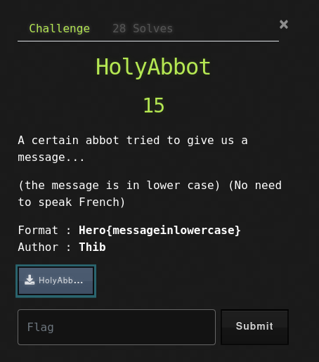  
 
Decode the file from Ave Maria cipher.  
 
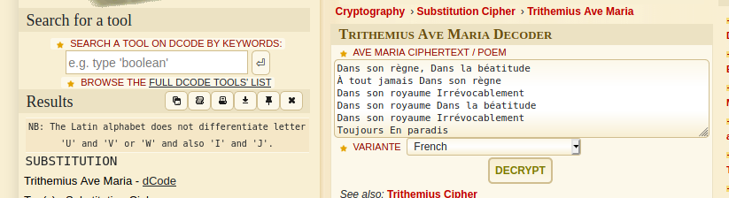  
### Phono
  
 
Download the PhonoPaper app and use it to listen to the downloadable file to hear the flag. 
