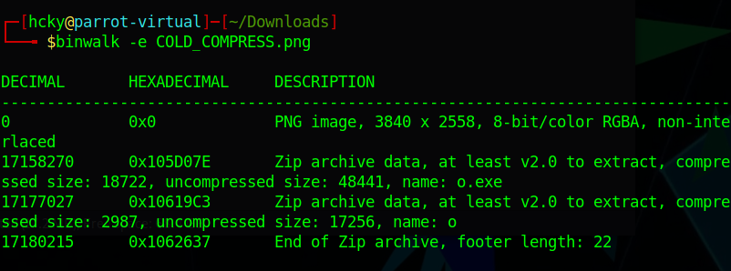
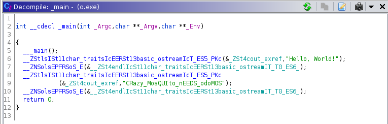
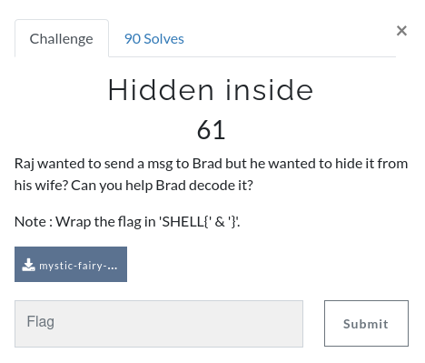
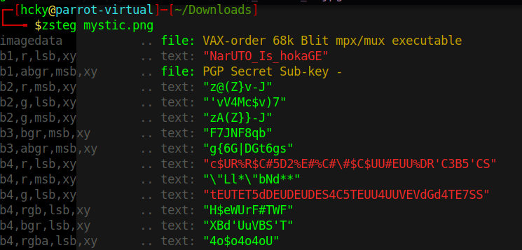
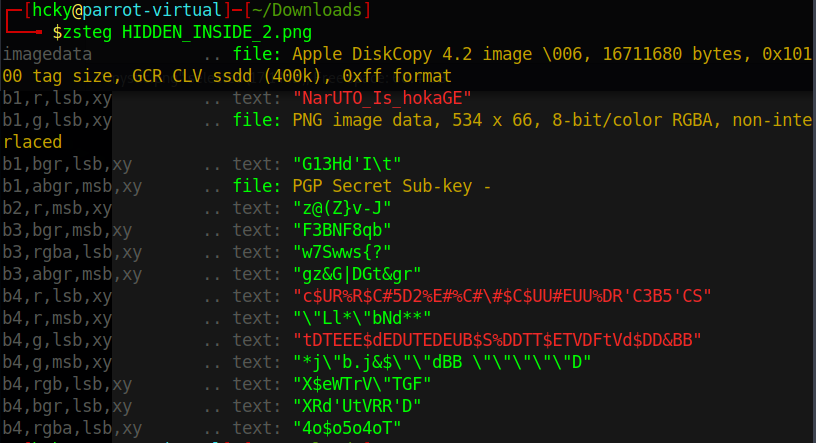
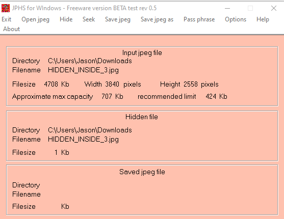

<div style="text-align:center">SHELL CTF Forensic Challenges </div>

<!--more-->

## 1. Cold Compress
<br>  

  

Not much going on in this one. Download the image file you're given and run binwalk against it to extract the embedded executable. I pulled the file up in Ghidra to see that all it does is print out the flag.  
<br>
  
<br>
  
<br>  

## 2. Grass Is Green 
<br>

  
<br>
This one is simple as well. Open the image in an editing program such as GIMP and raise the brightness until you can see the flag.  
<br>

  
<br>  

## 3. Hidden Inside 1, 2 and 3
<br>  

  

<br>

I forgot to screen shot the challenge info for all the Hidden challenges but they're all basically the same. The file is just modified for each challenge.  

For Hidden 1 change the extension to .png to view the file. You can just run [zsteg](https://github.com/zed-0xff/zsteg) against it to find the flag.  
<br>
  

<br>
Hidden 2 is also a png file with the wrong extension. You can run zteg again but this time it finds a hidden png file within the image.

```code
zsteg -E b1,g,lsb,xy hidden2.png > file.png
```
<br>

  

<br>

  

<br>
Hidden 3 is an a jpeg file which we can utilize JPEG Hide and Seek on to extract the hidden file. There was a hint on the challenge that gave the year a program was created which made finding the JPHS program easier to find.  
<br>

  

<br> 


 

