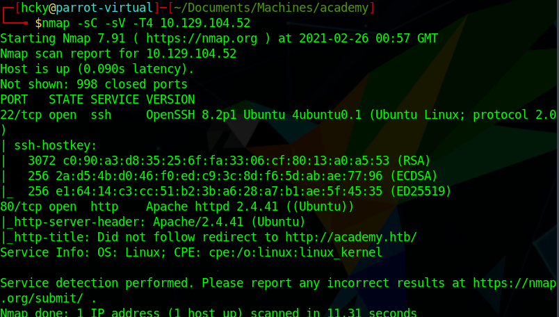
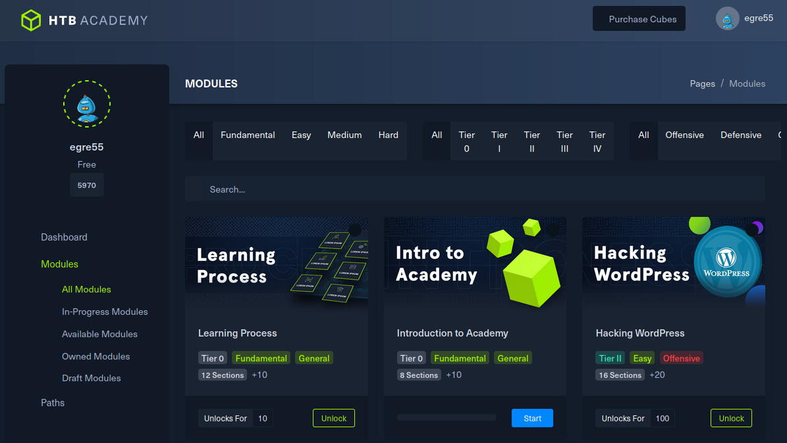
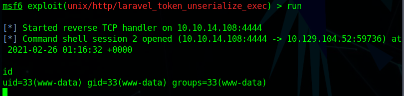
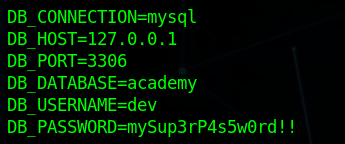
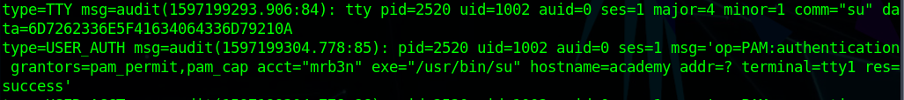
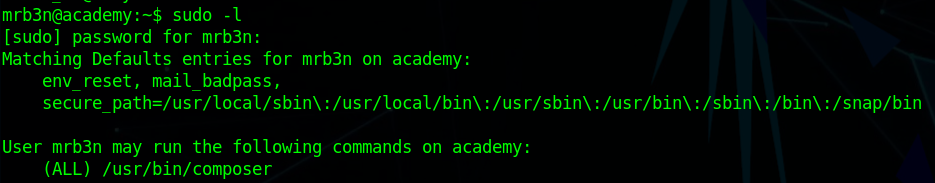
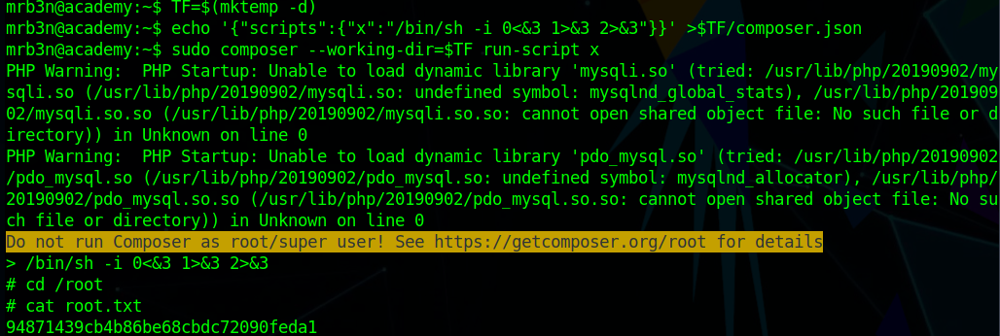

# Hack the Box - Academy


<div style="text-align:center">Write-up of Academy - Difficulty : Easy </div>

<!--more-->

>Learning Never Exhausts the Mind  
>  
> -Leonardo da Vinci  

## 1. Overview

Academy is a Linux box hosting an educational website.  
There is a form manipulation vulnerability to set yourself as an admin.  
After logging in as admin you are able to exploit a Laravel vulnerability to gain access to the box as www-data.  
An old environment file has some saved passwords that are readable to our user.   
Using that to login as the second user and find another password in the log files.  
Afterwards we're able to use GTFObins to escalate to root.

## 2. Recon

### 2.1 Nmap
As always we start off running a port scan with nmap and we see that ports 22 and 80 are open.
There is also redirect happening on port 80 to **ht<span>tp://</span>academy.htb**.

``` bash 
 nmap -sC -sV -T4 10.129.104.52
```




### 2.2 Website
#### 2.2.1 Academy.htb

First thing we need to do is add **academy.htb** to our **/etc/hosts** file so we're able to access the website.  
After we do that we can just browse to the website and see what's there.  
The only thing there is a login page and a register page, so after we register with random credentials ( I used test:test123 ) we're able to access the site.

  

It looks like we're logged in as egre55 but there's not too many useful things to interact with on the site.

Like most sites we should run **gobuster** or **ffuf** against it to see what other pages there are that we can access.

```bash
gobuster dir -w /opt/SecLists/Discovery/Web-Content/raft-large-words.txt -u http://academy.htb/ -x php 
```

  

We can see that there's an **/admin.php** page. If we go there it's just a normal login page and the credentials for the account we created earlier don't appear to let us in.  
Let's go back to that first register page and take a closer look at what's going on with **Burp**

  

If we change the role id from a 0 to a 1 it may give us a different role type for our account

  

With this new account let's go back and see if we can login to that admin site.  
After logging in as admin there is a to-do list that we can look at.  At the bottom of the list it looks like there's another website that we can access at **dev-staging-01.academy.htb**  


Time to go back and add that new site to our **/etc/hosts** file like we did at the start.

#### 2.2.2 Dev-staging-01

After we navigate to **dev-staging-01.academy.htb** we can see multiple errors being thrown at us for this staging site. If we look through some of them we see some mentions of **Laravel** which is our path to a foothold.


Doing some research we wind up at [CVE-2018-15133](https://nvd.nist.gov/vuln/detail/CVE-2018-15133).  This vulnerabiltiy allows for remote code execution as a result of an unserialize call on a potentially untrusted X-XSRF-TOKEN value.  
This vulnerability requires us to know the application key and thankfully for us it was divulged in the previous step.  
Luckily there's also a Metasploit module for this specific exploit.

## 3. Foothold

After we start up Metasploit we can use the exploit **/unix/http/laravel_token_unserialize_exec**.  
Once we fill out all the required option, ensuring that we copy the **APP_KEY** from the prior step, and put in the correct vhost we can just type **run** and let Metasploit do its thing.

  

Looks like it was able to come back with a shell as www-data.  
 
## 4. Privilege Escalation
### 4.1 First user  

We ran [LinPEAS](https://github.com/carlospolop/privilege-escalation-awesome-scripts-suite/tree/master/linPEAS) to see if there was any easy avenue for escalation but from what it looked like there wasn't.  After doing some manual poking around in the default directories we found **/var/www/html/academy/.env** which had a saved password in there for a MySQL database.  

  

Well we have a password, so let's run **getent passwd** and maybe **ls /home** to see what users on the box and who has a home directory.  

  

After trying the password on a few accounts we found that it was the correct login for the user **cry0l1t3**.  Since we have the password we can just SSH in as that user.  

  

**Cry0l1t3** happens to be the user with the user flag in their home directory so we can easily grab that on our way to root.

### 4.2 Second User

After doing some more enumeration as **Cry0l1t3** we can see that he's a member of the **adm** group which is the group that has read access to the log files in **/var/log**.  If we take a look in there and spend some time perusing the files we wind up at **/var/log/audit/audit.log.3** where an **su** command was executed and some data was captured in hexadecimal form.  

  

We can take that hex string to any number of online decoders and it will come back as **mrb3n_Ac@d3my!**.  Looks like this is the password for mrb3n.  We can just do a simple ** su - mrb3n** to switch over to our newly acquired user account.  

Thankfully mrb3n is able to use the sudo command. So let's list what he can do with it with a **sudo -l** command. Looks like he's able to run composer as root.

  

Easy enough, let's hop over to [GTFObins](https://gtfobins.github.io/) once again and see what it has for composer. We can run the below command and hop over to root to grab the root flag.

```bash
TF=$(mktemp -d)
echo '{"scripts":{"x":"/bin/sh -i 0<&3 1>&3 2>&3"}}' >$TF/composer.json
sudo composer --working-dir=$TF run-script x
```

  


## Conclusion

1. Ensure your registration procedures are secure.  There's no reason for someone to be able to self-register as an admin. The creator of the site, or current admins, can create additional accounts for new people.
2. Update your software. This CVE was relatively old at the time of use so an administrator should have had more than enough time to update their systems.
3. Don't re-use passwords accross multiple accounts.
4. Ensure you protect audit logs correctly as they normally hold valuable information.

<br>
<br>
<br>

<div style="text-align:center"><a href="https://www.hackthebox.eu/home/users/profile/190484"></a></div>
<div style="text-align:center">If this write-up was helpful consider leaving some respect on my HTB profile.</div>

