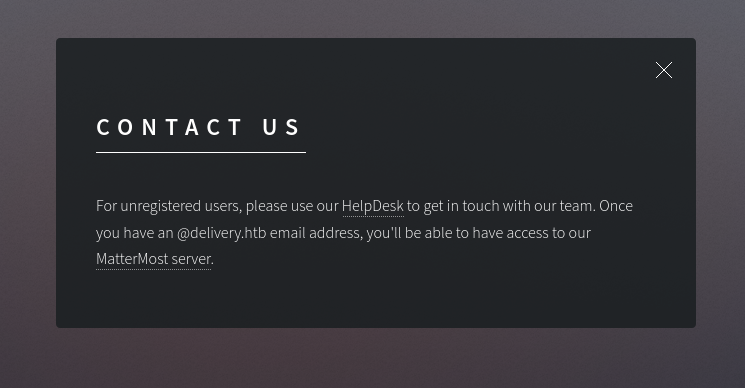
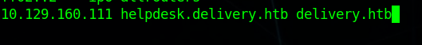
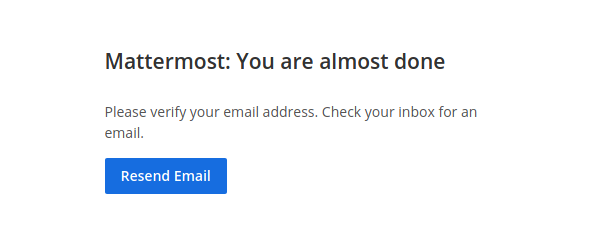
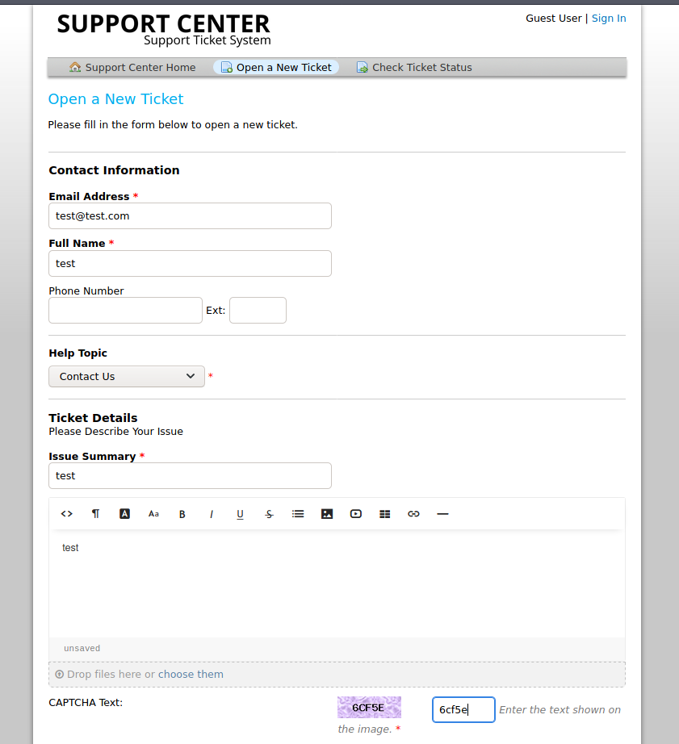
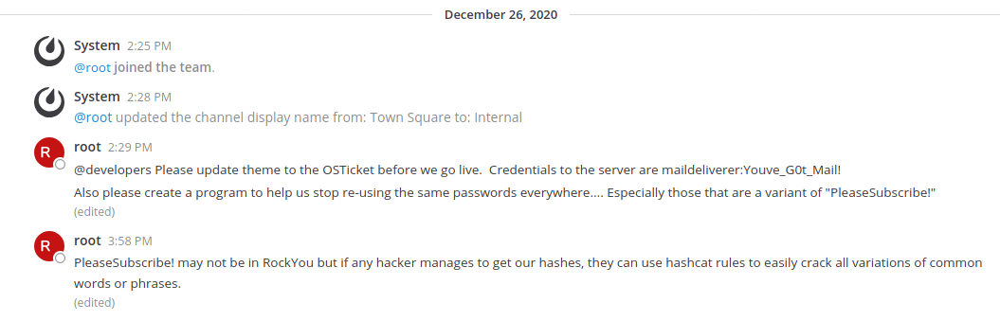
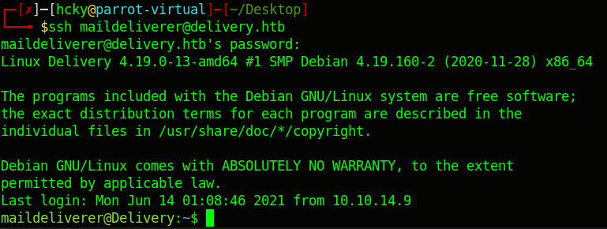
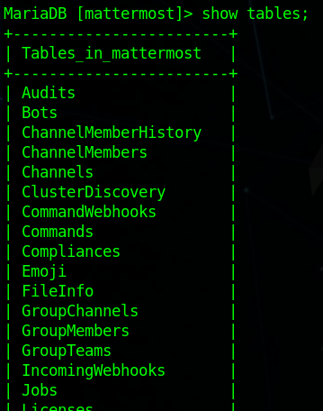
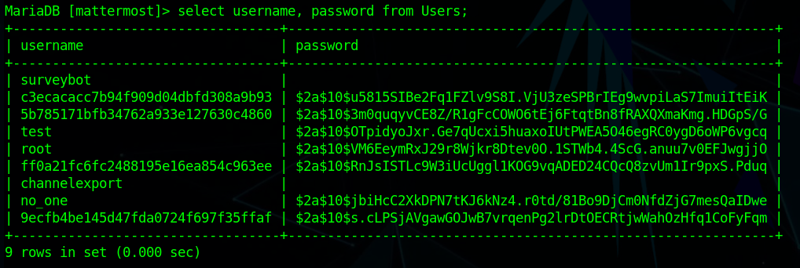
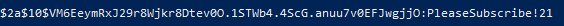
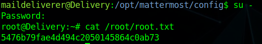

# Hack the Box - Delivery


<div style="text-align:center">Write-up of Delivery - Difficulty : Medium </div>

<!--more-->

>" As always we start with nmap... but it can take a while so I've already ran it."
>
>ippsec

## 1. Overview

Delivery consists of a poorly configured Linux box that has plenty of passwords left lying around by the system administrators. Poor password re-use policies allow escalation to root.  

## 2. Recon

### 2.1 Nmap
We start off running a port scan with nmap and we see that ports 22 and 80 are open.


``` bash 
 nmap -sC -sV 10.129.160.111 --min-rate 10000
```


### 2.2 Website
#### 2.2.1 Delivery

The first thing we do is check out the web page running on port 80.  

  

  

There's not much going on here except a link to the helpdesk and the company's MatterMost server. The website tells us that we'll need a @delivery.htb email address to access the MatterMost server.  

When clicking the links we get routed to helpdesk.delivery.htb and delivery.htb:8056.  
We can add both entries to our **/etc/hosts/** file so they resolve properly.  



#### 2.2.2 Mattermost

  
<br>
The registration process for the MatterMost server requires us to click the registration link that gets emailed to whatever address we put in. Since we're on a lab environment we clearly can't get access to that email.  
<br>

  
<br>
#### 2.2.3 Helpdesk

  
<br>
Just a basic helpdesk site. Nothing out of the ordinary when clicking around.  

## 3. Foothold

If we create a ticket on the helpdesk site it will give us our ticket number as well as an email address that we can send emails to if we want to update the ticket. Anything sent to this address will be added to the ticket.  
<br>

  

  
<br>
We can take that email address and attempt to use it to register to the MatterMost server since that registration link should show up in our ticket if an email is actually being sent.  
<br>

  
<br>

  

If we copy and paste that link it should allow us to verify our email address for server.  
<br> 

  
<br>
When we first login we are able to join the default chat room for the company. Looks like someone left a few messages that give quite a bit more info than they should be giving out.  
<br>

  
<br>
Someone left the credentials to the server, **maildeliverer:Youve_G0t_Mail!**, as well as a hint that the admins appear to be re-using credentials and variations of "PleaseSubscribe!".  
<br>
We can use the maildeliverer credentials to ssh into the box.  
<br>

  

This user can grab the user flag from their home directory.  


## 4. Privilege Escalation

After some manual enumeration of the box we find some configuration files for the MatterMost server in **/opt/mattermost/config**. In that file we find another username and password, this time for the mattermost sql database.  
<br>

  
<br>
Now we can just login to the local mysql server using our new credentials and see what we can find.  


  
<br>
Now that we're logged in we can run basic mysql commands. We find a Users table and we're able to grab username and hashes from that same table.  
```
show tables;
select username, password from Users;
```
<br>


  
<br>

  
<br>

Bring that hash over to hashcat along with our hint of the admins using variations of "PleaseSubscribe!" and we should be able to crack it with the help of the [OneRuleToRuleThemAll](https://github.com/NotSoSecure/password_cracking_rules), which will take our password and tell hashcat to generate a wordlist with common variations.  
<br>

  
<br>

  
<br>
It finds the correct password and we're able to switch users to root and grab the flag.  
<br>

  


## Conclusion

1. Don't leave confidential things lying around in places where anyone can find it. 
2. Ensure that your registration process for company assets is not easily circumvented in the name of convenience. The helpdesk could easily require you to login to update your ticket as opposed to providing an email on the domain which the MatterMost server requires for registration.  

<br>
<br>
<br>

<div style="text-align:center"><a href="https://www.hackthebox.eu/home/users/profile/190484"></a></div>
<div style="text-align:center">If this write-up was helpful consider leaving some respect on my HTB profile.</div>

