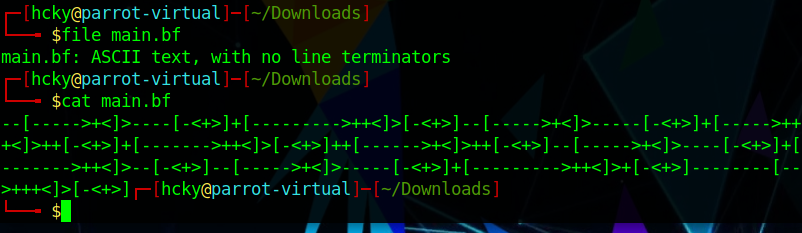
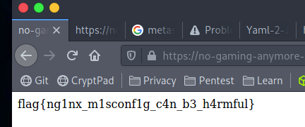
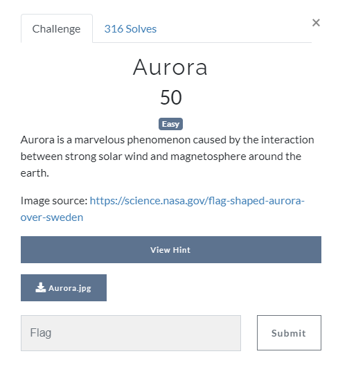
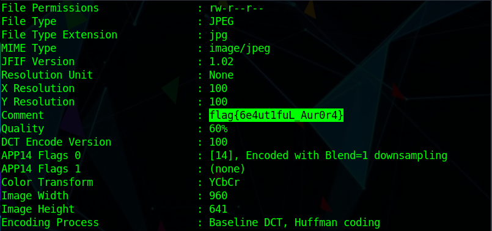

# HackPack CTF 2021 Write-Ups

HackPack CTF 2021

<!--more-->

## Euler's Identity

**MD5 =** d8d540ae49aadd151b96feb4e0ff124f ::: e^  
**SHA1 =** abb07ca45c9e7719e66e766b958d943f561b8de6::: ipi=  

**SHA-256 =** c037c03ee627047a85df540c42d59c6b6028841704a7c706feff584a997fd2a3  

**SHA1 =**5d3c4e0314c88f970ab3877e983527cf64d86a53  

**MD5 =**6bb61e3b7bce0931da574d19d1d82c88  

Each hash can be found by googling known hash websites. 

flag{e^ipi=-1}  

## BF means best friend, right?

  
 
Reading the file reveals text encoded in brainfuck. Decode it for the flag.  
 
  

## "N"ot "G"am"I"ng a"N"ymore in "X"mas 

  
 
Open the site while running burp, change the debug option from zero to one, go the the file location listed in your browser.  
 

 

 
  

## Aurora

 
Run exiftool on the downloaded file.  
 

