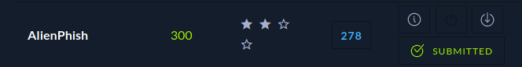
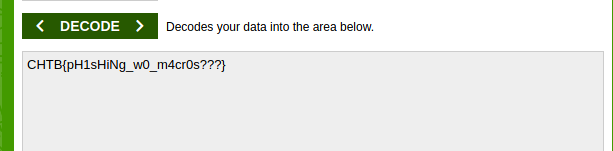
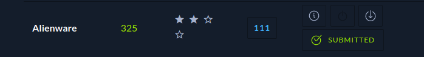
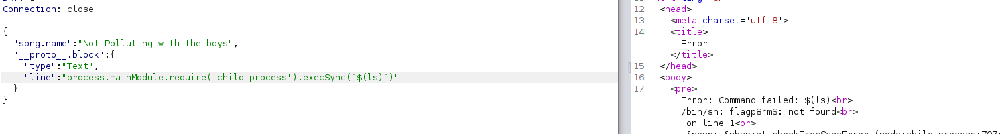
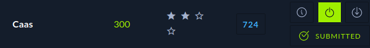
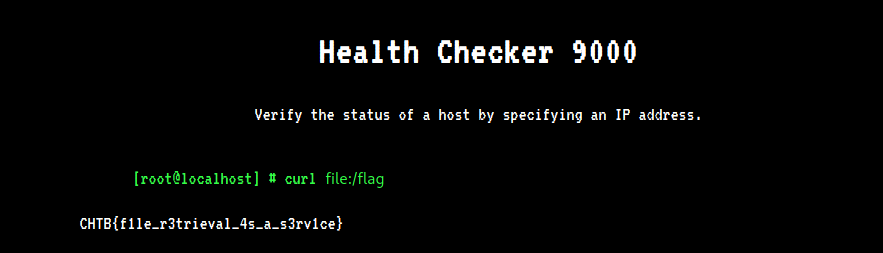
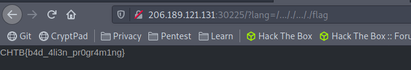

# Cyber Apocalypse 2021 - Challenges

## AlienPhish

  
 
Unzip the downloadable file and view the **slide1.xml.rels** file. Inside is a command with some of the text backwards. Flip the text and decode the base64 for the flag.  
 
  
  
 
## Authenticator

  
 
Open the downloadable file with Ghidra and look through the functions. In the check pin function is a string with a **^9**. Take the string to CyberChef and XOR with a key of 9 to get the flag.  
 
  
  
 
## BlitzProp
  
 
View the website and intecept the traffic with Burp. A hint is given on the song names since AST is capitalized. Check out [AST Injection](https://blog.p6.is/AST-Injection/) for some more info. Insert a command to read the directory the flag is in an then read the flag itself once you have the name.  
 
  

## CAAS

  
 
Have the website request **file:/flag** to read the flag.  
 

## MiniSTRYplace

  
 
Viewing the downloadable file tells us that requests with **../** will be replaced with a space. Exploit the LFI vulnerability by putting **..././.../.** before the file to read the flag. 
 
  

 

