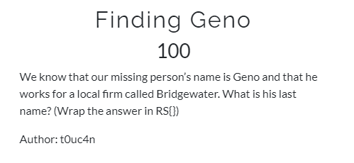
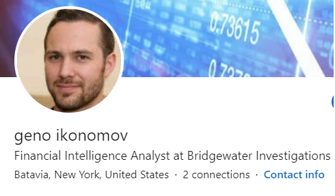
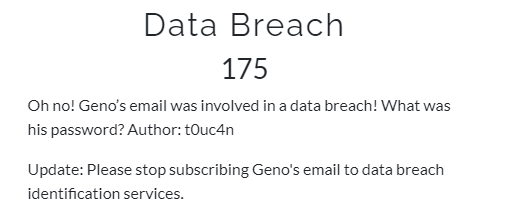
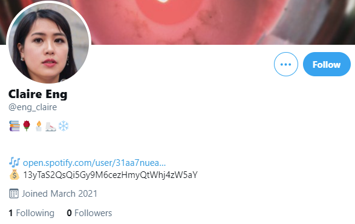
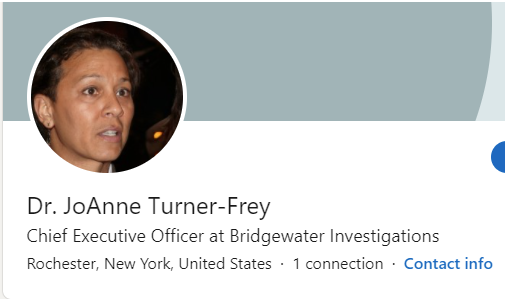
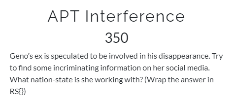
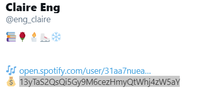

# RITSEC CTF 2021 - Intel

RITSEC CTF 2021 - Intel 

<!--more-->

## Finding Geno  

  
 
Just do a google search for Geno and Bridgewater and you'll find his LinkedIn page.  
 

## Data Breach

  
Geno has his email publicly viewable on the about me portion of his LinkedIn profile. Google search for that email and you'll wind up at a email/password dump site.  
 

## Music Signs

  
 
If you go to Geno's twitter page you can see he only has a couple people following him. One of them is Claire Eng. Click the Spotify link on her Twitter page and the flag is the first letter of each song in her only playlist.  
 

## OSINT Challenge

  
 
Check the other employees of Bridgewater Investigations on LinkedIn and you'll find the CEO is JoAnne Turner-Frey. Google her name or search it on Twitter and you can find her account easily. To find the park name I just googled her location from LinkedIn and peace park. The flag is the name of the park.  
 

## APT Interference

  
 
Claire's Twitter page from the previous challenge had a bitcoin address in it. Put the address into blockchain.com and you'll be able to see any recent transactions. She was recently paid by someone so we can take their bitcoin address and google it. We wind up at a website advertising the wallet for the government of Ackaria.  
 

